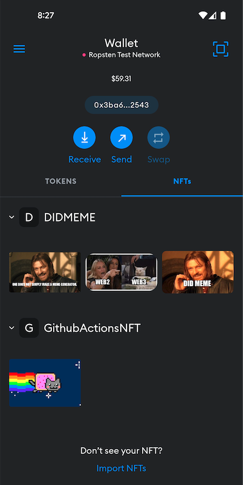

# NFT Actions

 

This GitHub actions allows you to mint an NFT and award it to an address using GitHub workflows.

### Contract Address

Deploying contracts with the account:

- [0x3ba6AB697180C18096B2D3fcad41C46ac3002543](https://ropsten.etherscan.io/address/0x3ba6AB697180C18096B2D3fcad41C46ac3002543)
  GithubActionsNFT deployed to:
- [0xa2E49db1a0707a1fFCcF061fB13168B176755CE8](https://ropsten.etherscan.io/address/0xa2E49db1a0707a1fFCcF061fB13168B176755CE8)

### Examples

See [demo.yml](./.github/workflows/demo.yml)

